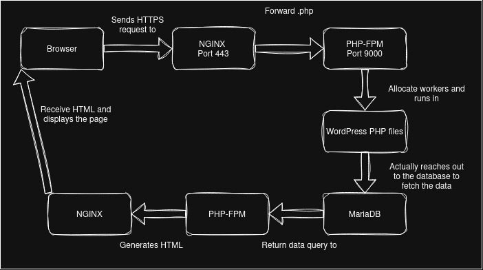
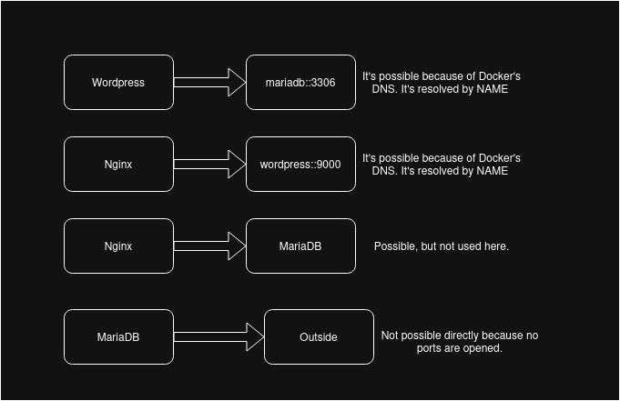

*This project has been created as part
of the 42 curriculum by cauffret*

<h2>Description</h2>

Like the very famous movie from Christopher Nolan, where the main concept is to implement a dream in a dream, the goal is here to **implement containers in a VM**.
For this we need to use **Docker** but let's come to this subject later on.
This whole process should allow us to have a Wordpress *website* with **MariaDB** (Wordpress database) using **NGINX**.
The base concept of containers is that if I have my container files as well as my volumes, I should be able to run this from any given setup as long as I have my initialisation files. However, if I don't have my volumes, I'll lose my database contents (accounts, posts, settings and so on) but WordPress will show an install wizard to ask you how you'd like to store the content.
Now **How does it work ?**:
- I have a docker compose that will call all of my services and the whole project is divided in four parts.
1) NGINX and TLS is about the handling of the server (HTTPS requests, and transmission protocol)
2) WordPress and php-fpm allows me to modify things inside of my Wordpress as well as interacting one with another.
3) MariaDB stores all of my website settings, such as account, posts and actual settings.
4) Volumes that are supposed to store what's in MariaDB and Wordpress + NGINX (PHP files).
**Then** you can run cauffret.42.fr to access the website.
If ever you want to access as the admin need to acces the admin part of the wordpress website. cauffret.42.fr/wp-admin/.

<h3>Additional Requirements</h3>

`Virtual Machines vs Docker`:
While a Virtual Machine is actually simulating hardware and lets you run code on a given OS, Docker creates containers that will allow to run the same code in *any given machine* as it's used in the containers anyways.
Concerning resources, a VM emulates hardware components, and the whole machine is basically ran from those emulated hardwares. It emulates the **whole** computer. 
That's not the case for Docker, it uses the host machine components in order to create in containers file system, dependency structure, processes and network capabilities. It uses the host machine as **power supplier** to deal with what it has to do.
`.env VS Secrets`:
Environment variables are references that can be called with a specific name. Let's say my login is cauffret, i could write it as so in my .env *LOGIN=cauffret* and I'll be able to use it in my project when specifying the name like ${LOGIN}.However it is a plain text file on the disk, with no encryption.
Docker Secrets is a bit different, it's basically passwords that are encrypted and managed by Docker. They can be accessed via /run/secrets/ inside the container. As it's encrypted more security.
`Docker Network VS Host Network`: 
On Docker Network, Containers get their own IPs, and they're isolated from the host. They can connect to other containers using the container's name and the port like wordpress:9000. You also have to manually set the map for ports. Unless you want to (by exposing a port), you cannot reach the containers from the outside.
On Host network, the containers share the host network directly , there is no DNS, so we use localhost. As the ports are directly on the host, there is no need to manually map. Everything is exposed however.
`Docker Volumes VS Bind Mounts`:
A Docker Volume is a Volume which is managed by Docker. The syntax implies that there is the name of the container then the path towards where you want the volume to be: like mariadb:/var/lib/mysql, however it is still stored on the host.
A Bind Mount is just a volume you create on your host, and share to Docker. It's not managed by Docker but by the user, and has a classic path. It's not visible in docker volumes. 

<h2>Instructions</h2>

Docker-compose.yml will actually call three DockerBuild images:
1) <h3>MariaDB</h3> is composed of three main parts in it. The first is the `setup.sh` that will initialise and launch my MariaDB session. I specify where the socket is so that the script.sh (which is a process as soon as I execute it) can talk with mariaDB process during the initialisation. 
I then use mysqld to start MariaDB to initialise it as a system user (for security) specifying where the DB files are (Im going to check up if there is data in it or not, to determine if it's first run or not !), also need to create a socket file, because my services are connected, so that allows intercommunication between script and MariaDB, *&* is so that the process runs in the bkg temporarily (Need to check if there is a database directory or not).
If it's the first run(there is no DB directory yet), I can use the *e* argument to single SQL inline (instead of having to put everything in an SQL file). I also need to specify the socket to work on mysqld process. 
The *%* serves as a wildcard so that any host can connect to it. The rest is SQL syntax. Flush allows us to reload permission tables. 
We had a **temporary background to fill if needed** once it's done OR if it's already done, we can shut it down because Docker main process (that it listens to) is PID1, and right now it's shell as shell setup launched first. But I can replace it with exec (So that Docker knows if MariaDB crashed or not.)
I also need to set the network interface MariaDB listens to, because we need inter-container communication, so I cannot put it as local (localhost) as it would not be able to communicate with other servers otherwise.
The second is the `server-50.cnf`, it contains the information mysqld reads everytime mariaDB launches.
**user** specifies who will run mysql's instance.
**pid-file** where to store the PID file.
**socket** the socket path for local connections.
**port** TCP port to listen to.
**basedir** the installation directory
**datadir** where the db files are stored.
**tmpdir** Temporary files location.
**lc-message-dir** Where the error messages would be located (lc stand for locale == translation)
**bind-address** We talked about this one above.
Lastly, the `dockerfile` is like the instruction manual of what to do on the docker container, it runs the scripts, allows different accesses, and also opens the port 3306.
2) <h3>WordPress</h3> has 3 main files:
`setup.sh`: First needs to launch MariaDB and make sure that it's working. Then, we need to download WP's core files, while it's doing so we are using the env variables to setup the wp-config.php. We then perform the core installation stating the domain name we already put in the .env file as well. Once this is done, we need to create a mandatory user (that's not root/ admin).
`www.conf`: So this is basically a php-fpm pool configuration. **It allows to have a custom server configuration, and differs from one website to another.**
Let's take a look at the arguments: **[www]** is the pool's name, **user** is which user will run the php process, here standard web user for security, **group** is the group the user belongs to, also standard here, **listen** is the TCP port used to communicate with other services. **pm** is the process manager, because each php request requires a new worker. Heavy site = more things, more workers, slower. Light website = less workers, faster website but less things. the dynamic arguments lets the pm decide how much workers should be used.
**pm.max_children** decides the maximum amount of workers and **pm.start_servers** decides the starting amount of workers. **pm.min_spare_servers** gives the n minimum worker amount that is idle. **pm.max_spare_server**  gives the n max worker amount that can be idle.
Here's a schema on how that works:

`Dockerfile` : We need to install curl (Client URL) to transfer data from github, as we need the CLI version of Wordpress as we need to use a setup wizard otherwise.
3) <h3>NGINX</h3> Only has a `nginx.conf` and `Dockerfile`:
Listen on 443, and [::]:443 represents IPV6 format.
Also includes a path to a SSL certificate (I dont have official one, thug life XD) and we need a path to the private key to encrypt the traffic. Answers to requests for cauffret.42.fr
It has a shared volume with WordPress and we need to locate where those files are at. It has a list of default files to serve to people connected to the server ( what to display and how the page behaves).
The we have a regular request handler **$uri** tries it as the exact file, the **$uri/** tries it as a directory, and if it does not work, return a 404NF.
For php files, it's different, it needs to be forwarded to the PHP-FPM in the WordPress container.
Concerning the `Dockerfile` let's take a look at the ssl part as its the interesting one. **req -x509** generates a self-signed certificate (Not verified, will trigger a warning in modern browsers) **-nodes** means there is no password on the private key file, so NGINX can read it simply. **-days 365** validates the certificate for one year. **-out** output for the public certificate, **-keyout** where to save the private key. **subj** if we want identity infos about the certificate(from, validity etc..)
Then when we execute on the end, we also need to tell NGINX not to **daemon** because if it does, the original process exits, which will stop the container as Docker is monitoring it.

<h3>Docker-compose.yml</h3>
The orchestra leader, and also explains us the concept of app_network as well as volumes that are used. Our containers are split but not really split. They actually use `app_network` a private virtual network that can only be used by containers from docker-compose. They all have their own IPs, and they can communicate with each other using **names**, that's a bridge connection.
Network schema: 

Now to talk about the volumes, we'll have two of them: 
- **mariadb** is used by MariaDB only, the container path is /var/lib/mysql.
- **wordpress** is used by both WordPress AND NGINX, path is /var/www/html. Wordpress writes PhP files here and NGINX reads them to serve CSS/Images and so that NGINX knows where to find .php files to forward.
For both of them, the data persists if the containers are destroyed and rebuilt, it's only lost when the host directories (outside of container) loses the data.
There is only one single entry point, which is NGINX (443), as it's required by the subject. The rest is only accessible from within the Docker's network.

<h2>Resources:</h2>

- https://docs.docker.com/ Was used to ask questions about the main structure (compose, as well as dockerfiles)
- https://mariadb.com/docs Was used to understand DBs as we didn't use them before.
- I didn't do webserv, had to understand what NGINX would do kind of https://nginx.org/en/docs/
- The series from my favourite sysadmin :p https://www.youtube.com/watch?v=SXB6KJ4u5vg&pp=ygUMaW5jZXB0aW9uIDQy
AI was used in this project to help with the syntax as I'm not used to write with this code. I'd basically make a whole soup with my logic, it would help me to refine my concept and syntax as well as as a StackOverflow answering bot haha.